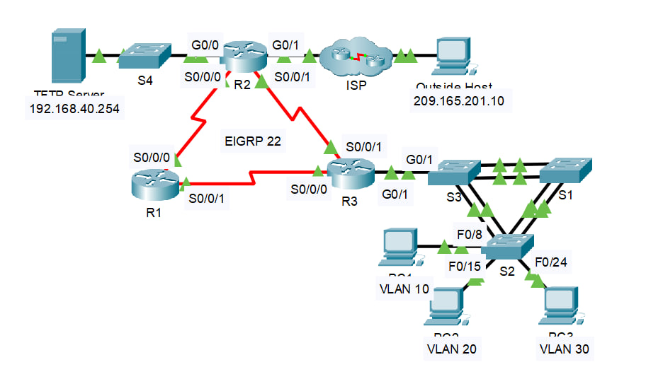
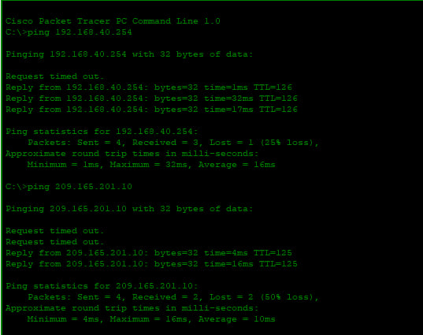

# Enterprise Network Troubleshooting Lab

A small enterprise network troubleshooting lab built in **Cisco Packet Tracer**. The lab combines switching, routing, DHCP, NAT, and WAN technologies into a single topology with intentionally misconfigured devices.

The objective was to analyze the existing configuration, identify issues that violated the network requirements, implement corrective changes, and verify end-to-end connectivity.

## Topology

## Lab Objectives

The network was required to meet the following specifications:

### Switching

* S2 must be the **STP root bridge** for VLANs 1, 10, and 20.
* S3 must be the **STP root bridge** for VLANs 30 and 88.
* Switch trunk links must use **VLAN 99 as the native VLAN**.
* R3 provides **inter-VLAN routing** for the user VLANs.

### DHCP

R3 is responsible for providing DHCP services for:

* VLAN 10
* VLAN 20
* VLAN 30

### Routing

* All routers must use **EIGRP AS 22**.
* R2 must have a **default route toward the ISP**.
* R2 must redistribute the default route through EIGRP.
* NAT must be configured on R2 so that internal addresses are translated before accessing the Internet.

### WAN Technologies

The serial links must use the following encapsulations:

| Link    | Required Technology |
| ------- | ------------------- |
| R1 ↔ R2 | Frame Relay         |
| R2 ↔ R3 | HDLC                |
| R1 ↔ R3 | PPP with CHAP       |

### Connectivity

All devices should be able to communicate with each other according to the addressing table and the network requirements.

---

## Troubleshooting Approach

Rather than rebuilding the network from scratch, the existing configuration was inspected against the requirements.

The troubleshooting process generally followed:

1. Identify the requirement that was not being met.
2. Inspect the relevant device configuration and operational state.
3. Determine the root cause.
4. Apply the minimum configuration change required.
5. Verify the change using show commands and connectivity tests.

## Issues Identified and Resolved

| Device | Issue Identified                                                                                                  | Resolution                                                                 | Verification                                                                                                 |
| ------ | ----------------------------------------------------------------------------------------------------------------- | -------------------------------------------------------------------------- | ------------------------------------------------------------------------------------------------------------ |
| **S2** | S2 was not the STP root bridge for VLANs 1, 10, and 20.                                                           | Configured S2 as the primary root bridge for VLANs 1, 10, and 20.          | `show spanning-tree summary` confirmed S2 as the root bridge.                                                |
| **S1** | Trunk links were using VLAN 1 instead of VLAN 99 as the native VLAN.                                              | Configured VLAN 99 as the native VLAN on the trunk interfaces.             | `show interfaces trunk` confirmed native VLAN 99.                                                            |
| **S3** | The S3–R3 uplink was configured as an access port instead of a trunk, preventing multiple VLANs from reaching R3. | Configured the interface as a trunk and allowed VLANs 10, 20, 30, and 88.  | `show interfaces g0/1 switchport` confirmed trunk operation. DHCP and inter-VLAN connectivity were restored. |
| **R2** | R2's default route pointed to G0/0 instead of the ISP-facing G0/1 interface.                                      | Removed the incorrect route and configured the default route through G0/1. | `show ip route` confirmed the default route through G0/1.                                                    |
| **R2** | NAT inside/outside roles were reversed.                                                                           | Corrected the NAT roles on G0/0 and G0/1.                                  | NAT configuration and connectivity tests confirmed correct operation.                                        |
| **R1** | The R1–R2 serial link was not using the required Frame Relay encapsulation.                                       | Configured `encapsulation frame-relay` on the serial interface.            | `show interfaces s0/0/0` confirmed Frame Relay encapsulation.                                                |
| **R1** | PPP CHAP authentication toward R3 failed because the local username did not match the remote router's hostname.   | Configured `username R3 password ciscoccna` on R1.                         | `show interfaces s0/0/1` confirmed the PPP interface was up/up.                                              |

## Final Verification

After resolving the identified issues, the network was tested against the original requirements.

* [x] S2 is the STP root for VLANs 1, 10, and 20.
* [x] S3 is the STP root for VLANs 30 and 88.
* [x] Trunk links use VLAN 99 as the native VLAN.
* [x] R3 provides inter-VLAN routing.
* [x] DHCP operates for VLANs 10, 20, and 30.
* [x] EIGRP operates using AS 22.
* [x] R2 has a default route toward the ISP.
* [x] R2 redistributes the default route through EIGRP.
* [x] NAT operates correctly on R2.
* [x] R1–R2 uses Frame Relay.
* [x] R2–R3 uses HDLC.
* [x] R1–R3 uses PPP with CHAP.
* [x] End-to-end connectivity was verified using ping tests.

### Connectivity Test

The final configuration was validated by testing connectivity from a
client PC to both an internal server and an external destination.

## Key Takeaways

This lab provided practice troubleshooting multiple technologies within the same network rather than troubleshooting each technology in isolation.

The main troubleshooting lessons were:

* Compare the **actual configuration** against the intended network requirements.
* Use operational `show` commands to verify how the device is actually behaving.
* Trace connectivity problems across multiple layers instead of assuming the fault is on the endpoint.
* Verify both the **configuration change** and the resulting **network behavior**.
* Use end-to-end testing to confirm that individual fixes work together as a complete system.

## Lab Environment

* **Platform:** Cisco Packet Tracer
* **Focus:** Network troubleshooting
* **Level:** CCNA
* **Technologies:** VLANs, STP, 802.1Q trunking, inter-VLAN routing, DHCP, EIGRP, NAT, Frame Relay, HDLC, PPP, and CHAP

